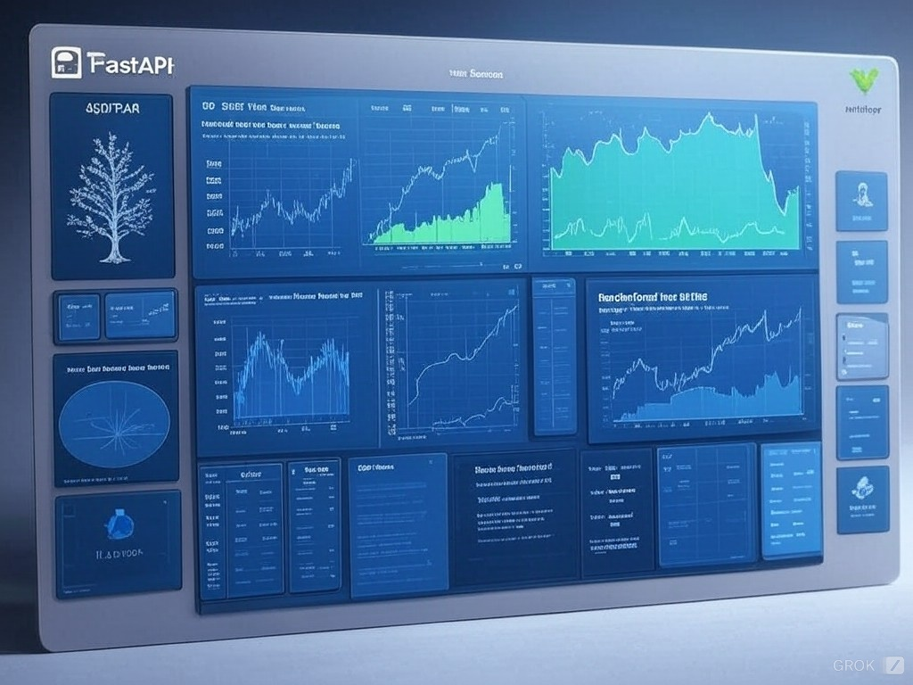

# Energy Demand Forecasting Project


### Energy Demand Forecasting Project

This repository provides a comprehensive solution for forecasting energy demand and prices using historical data on energy production, consumption, and weather conditions. The project combines Python-based machine learning models with MLflow integration for experiment tracking and a modern web interface powered by Next.js and TailwindCSS.

#### Features
- **Data Processing**: Handles missing values, outliers, and performs feature engineering.
- **Model Development**: Utilizes RandomForest, XGBoost, and Linear Regression models with MLflow experiment tracking.
- **Time Series Analysis**: Includes SARIMA for seasonal decomposition and forecasting.
- **Deployment**: Provides a FastAPI-based RESTful API for live predictions.
- **Web Application**: An intuitive and sleek user interface for interacting with prediction models.

---

#### Project Structure

```plaintext
.
├── data
│   ├── raw               # Raw energy and weather datasets
│   ├── processed         # Processed datasets
├── models                # Saved models
├── scripts               # Backend Python scripts
│   ├── preprocess.py     # Data cleaning and feature engineering
│   ├── train.py          # Training and saving models with MLflow
│   ├── test.py           # Testing trained models
│   ├── app.py            # FastAPI application
├── energy-prediction-app # Frontend Next.js application
│   ├── src/app           # Next.js pages and components
│   ├── public            # Static assets
│   ├── styles            # Global CSS and Tailwind configuration
├── encoders              # Saved encoders and scalers
├── README.md             # Project documentation
└── LICENSE               # License file
```

---

#### Installation

##### Backend Setup
1. Clone the repository:
    ```bash
    git clone https://github.com/your-repository/energy-demand-forecasting.git
    cd energy-demand-forecasting
    ```

2. Set up a Python virtual environment and install dependencies:
    ```bash
    python3 -m venv .venv
    source .venv/bin/activate
    pip install -r requirements.txt
    ```

3. Prepare the dataset:
    - Place raw datasets in the `data/raw` directory.
    - Run `preprocess.py` to clean and process the data.

4. Train models:
    ```bash
    python scripts/train.py
    ```

5. Start the FastAPI backend:
    ```bash
    uvicorn scripts.app:app --reload
    ```
    Access the API at [http://127.0.0.1:8000/docs](http://127.0.0.1:8000/docs).

##### Frontend Setup
1. Navigate to the `energy-prediction-app` directory:
    ```bash
    cd energy-prediction-app
    ```

2. Install dependencies:
    ```bash
    npm install
    ```

3. Start the Next.js development server:
    ```bash
    npm run dev
    ```
    Access the web application at [http://localhost:3000](http://localhost:3000).

---

#### MLflow Integration
This project integrates MLflow for:
- Experiment tracking (parameters, metrics, and artifacts).
- Model storage and versioning.

Before running `train.py`, ensure MLflow tracking server is running:
```bash
mlflow ui
```

Access MLflow UI at [http://localhost:5000](http://localhost:5000).

---

#### Usage

##### API Endpoints
- **GET /**: Home page of the API.
- **POST /predict**: Predicts energy demand using the provided input.

Example Input:
```json
{
    "generation_biomass": 200,
    "generation_fossil_gas": 5000,
    "generation_hydro_water_reservoir": 2500,
    "generation_solar": 300,
    "generation_wind_onshore": 6000,
    "total_load_forecast": 26000,
    "hour": 15,
    "day_of_week": 2,
    "month": 12,
    "is_weekend": 0,
    "season": 3
}
```

Example Response:
```json
{
    "prediction": 26500.3
}
```

##### Frontend
The web application provides:
- **Home Page**: Introduction to the energy forecasting tool.
- **Prediction Form**: Interactive form for submitting data to generate predictions.
- **Results Display**: Displays the prediction result or errors in a user-friendly manner.

---

#### Contributing
Feel free to fork this repository and submit pull requests. For major changes, please open an issue first to discuss your ideas.

---

#### License
This project is licensed under the MIT License - see the LICENSE file for details.
